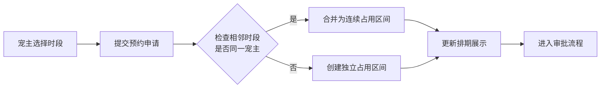
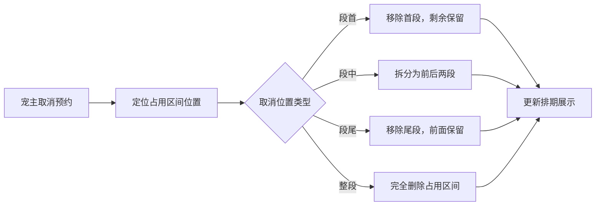
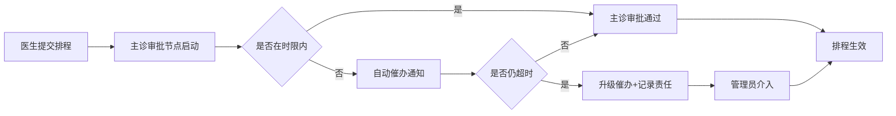

## 1. 产品概述

宠物医院牙科治疗台预约H5页面，旨在解决宠物医院牙科治疗设备资源调度、时段占用合并拆分、排程审批流转及超时催办等核心业务问题，提升诊疗效率与服务质量。

- 面向宠物医院医生、护士、前台及宠主，提供治疗台预约、审批、追踪全流程管理
- 核心价值：优化治疗台资源利用率、减少人工调度成本、审批透明化、超时责任可追溯

## 2. 核心功能

### 2.1 用户角色

| 角色 | 登录方式 | 核心权限 |
|------|----------|----------|
| 宠主 | 手机号登录 | 查看治疗台排期、提交预约申请、查看审批状态、取消预约 |
| 医生 | 工号登录 | 提交治疗排程、查看审批进度、处理审批节点 |
| 主诊医生 | 工号登录 | 审批治疗排程、查看超时预警、升级催办 |
| 管理员 | 工号登录 | 治疗台资源建档、配置审批流程、查看超时责任统计 |

### 2.2 功能模块

1. **治疗台排期模块**：治疗台资源建档、时段可视化展示、预约提交
2. **占用合并拆分模块**：连续时段自动合并、取消预约智能拆分、占用区间实时更新
3. **排程审批模块**：审批流程配置、审批轨迹留痕、多节点流转
4. **超时催办模块**：节点超时计时、自动催办通知、超时升级、责任追踪

### 2.3 页面详情

| 页面名称 | 模块名称 | 功能描述 |
|----------|----------|----------|
| 治疗台排期首页 | 治疗台列表 | 展示所有治疗台设备状态，支持按日期筛选 |
| 治疗台排期首页 | 时段时间轴 | 以时间轴形式展示一天各时段占用/空闲状态 |
| 治疗台排期首页 | 预约操作 | 选择时段提交预约申请，支持连续时段选择 |
| 预约详情页 | 占用合并展示 | 展示同一宠主连续合并的占用区间 |
| 预约详情页 | 取消预约 | 取消单个或部分时段，触发占用拆分逻辑 |
| 审批中心页 | 审批列表 | 展示待审批/已审批排程，按状态分类 |
| 审批中心页 | 审批操作 | 同意/驳回审批，填写审批意见 |
| 审批中心页 | 审批轨迹 | 展示完整审批流转记录，含时间、节点、操作人 |
| 超时监控页 | 超时预警 | 展示即将超时和已超时的审批节点 |
| 超时监控页 | 催办记录 | 展示自动催办和人工催办历史 |
| 超时监控页 | 责任统计 | 按人员统计超时次数和时长，支持排名 |
| 治疗台管理页 | 资源建档 | 新增/编辑/删除治疗台设备信息 |
| 治疗台管理页 | 时段配置 | 配置每日可预约时段、时长、间隔 |

## 3. 核心流程

### 3.1 预约与占用合并流程

宠主选择治疗台和时段提交预约 → 系统检查相邻时段是否为同一宠主 → 若相邻且同一宠主则合并为一段占用 → 更新排期展示 → 进入审批流程

### 3.2 取消预约与占用拆分流程

宠主发起取消预约 → 系统判断取消位置（段首/段中/段尾） → 拆分占用区间为多段 → 更新排期展示 → 同步更新审批状态

### 3.3 审批与超时催办流程

医生提交排程 → 主诊医生审批节点计时开始 → 超时前自动催办 → 超时后升级催办 → 记录超时责任人 → 审批完成归档

## 4. 用户界面设计

### 4.1 设计风格

- **主色调**：医疗蓝 #1E88E5，传达专业、信任感
- **辅助色**：薄荷绿 #4CAF50（空闲/通过）、暖橙 #FF9800（预警）、警示红 #F44336（超时/驳回）
- **按钮风格**：圆角矩形按钮，微阴影，点击有按压动效
- **字体**：思源黑体，清晰易读，适配移动端
- **布局风格**：卡片式布局，信息层级分明
- **图标风格**：线性图标，简洁现代

### 4.2 页面设计概览

| 页面名称 | 模块名称 | UI元素 |
|----------|----------|--------|
| 治疗台排期首页 | 顶部导航 | 返回按钮、页面标题、日期选择器 |
| 治疗台排期首页 | 治疗台卡片 | 设备名称、状态标签、今日占用率 |
| 治疗台排期首页 | 时间轴 | 24小时时间刻度、占用色块、空闲时段 |
| 治疗台排期首页 | 底部操作栏 | 批量选择、提交预约按钮 |
| 审批中心页 | 标签切换 | 待审批、审批中、已完成 |
| 审批中心页 | 审批卡片 | 宠主信息、宠物信息、治疗项目、提交时间 |
| 审批中心页 | 审批轨迹 | 时间线展示，节点状态用颜色区分 |
| 超时监控页 | 预警看板 | 超时数量、即将超时数量、今日催办次数 |
| 超时监控页 | 超时列表 | 排程信息、超时节点、已超时时长、责任人 |

### 4.3 响应式设计

- 采用移动端优先设计，适配主流手机屏幕（375px-430px宽度）
- 支持横屏展示，时间轴可横向滚动
- 触摸优化：按钮最小点击区域44x44px，手势滑动切换日期
- 关键信息采用大号字体，确保小屏可读性

### 4.4 交互动效

- 页面切换：左右滑动过渡
- 时段选择：点击时缩放+颜色渐变动效
- 审批状态更新：顶部滑入通知条
- 超时提醒：脉冲动画吸引注意力
- 时间轴滚动：惯性滚动，边缘渐隐提示
