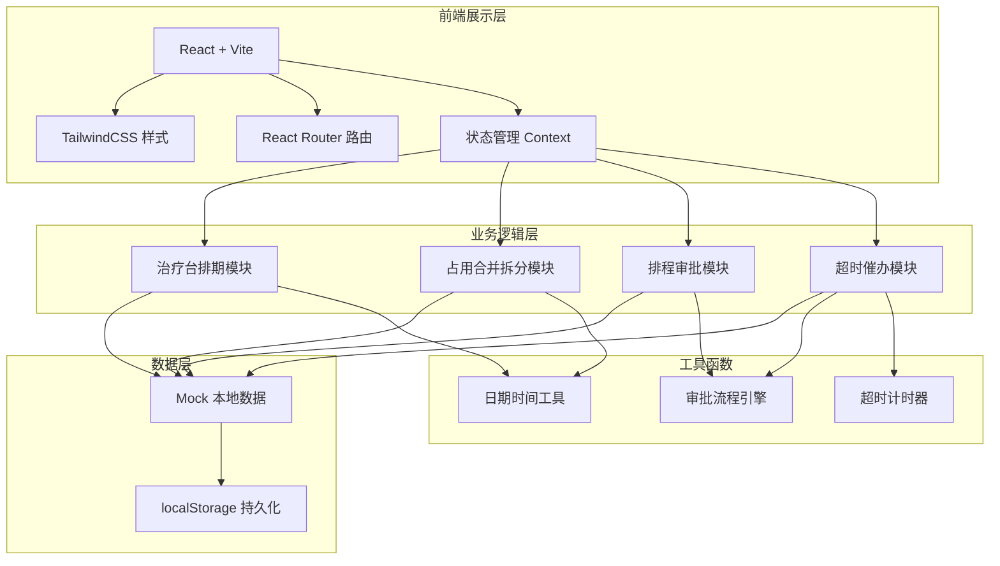
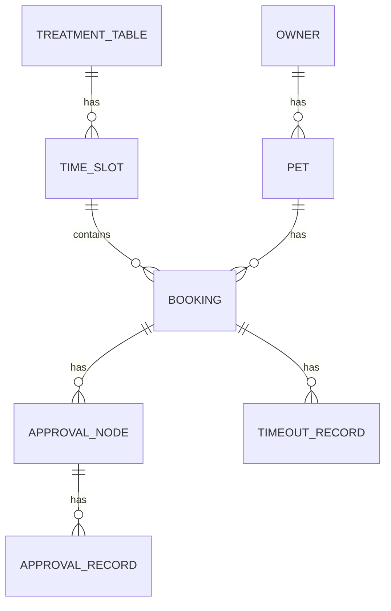

## 1. 架构设计



## 2. 技术栈说明

- **前端框架**：React@18 + TypeScript + Vite@5
- **样式方案**：TailwindCSS@3
- **路由管理**：React Router DOM@6
- **状态管理**：React Context + useReducer
- **图标库**：Lucide React
- **数据持久化**：localStorage
- **开发语言**：TypeScript

## 3. 目录结构

```
src/
├── components/       # 公共组件
│   ├── layout/  # 布局组件
│   ├── schedule/   # 排期相关组件
│   ├── approval/ # 审批相关组件
│   └── common/   # 通用组件
├── pages/        # 页面组件
│   ├── SchedulePage/
│   ├── ApprovalPage/
│   ├── TimeoutPage/
│   └── ManagementPage/
├── context/      # 状态管理
│   ├── ScheduleContext.tsx
│   └── ApprovalContext.tsx
├── utils/        # 工具函数
│   ├── dateUtils.ts
│   ├── mergeUtils.ts
│   ├── approvalUtils.ts
│   └── timeoutUtils.ts
├── types/        # 类型定义
│   └── index.ts
├── data/         # Mock数据
│   └── mockData.ts
├── hooks/        # 自定义Hooks
│   ├── useTimeout.ts
│   └── useApproval.ts
├── App.tsx
├── main.tsx
└── index.css
```

## 4. 路由定义

| 路由 | 页面 | 页面说明 |
|------|------|----------|
| / | 治疗台排期页 | 展示治疗台列表和时间轴排期 |
| /schedule/:id | 预约详情页 | 展示预约详情和取消操作 |
| /approval | 审批中心页 | 审批列表和审批操作 |
| /approval/:id | 审批详情页 | 审批详情和审批轨迹 |
| /timeout | 超时监控页 | 超时预警和催办记录 |
| /management | 治疗台管理页 | 治疗台资源建档和配置 |

## 5. 数据模型

### 5.1 实体关系图



### 5.2 数据类型定义

```typescript
// 治疗台
interface TreatmentTable {
  id: string;
  name: string;
  description: string;
  status: 'active' | 'maintenance' | 'disabled';
  createdAt: string;
}

// 时段
interface TimeSlot {
  id: string;
  tableId: string;
  date: string;
  startTime: string;
  endTime: string;
  status: 'free' | 'booked' | 'merged';
  bookingId?: string;
}

// 预约/排程
interface Booking {
  id: string;
  tableId: string;
  ownerId: string;
  ownerName: string;
  petId: string;
  petName: string;
  treatmentType: string;
  startTime: string;
  endTime: string;
  date: string;
  status: 'pending' | 'approved' | 'rejected' | 'cancelled';
  mergedSlotIds: string[];
  currentApprovalNodes: ApprovalNode[];
  createdAt: string;
  submittedBy: string;
}

// 审批节点
interface ApprovalNode {
  id: string;
  bookingId: string;
  nodeName: string;
  nodeOrder: number;
  assignee: string;
  assigneeName: string;
  status: 'pending' | 'approved' | 'rejected' | 'timeout';
  startTime: string;
  endTime?: string;
  timeoutDuration: number; // 分钟
  comment?: string;
}

// 审批记录
interface ApprovalRecord {
  id: string;
  nodeId: string;
  bookingId: string;
  action: 'approve' | 'reject' | 'timeout' | 'escalate';
  operator: string;
  operatorName: string;
  comment?: string;
  timestamp: string;
}

// 超时记录
interface TimeoutRecord {
  id: string;
  bookingId: string;
  nodeId: string;
  assignee: string;
  assigneeName: string;
  timeoutDuration: number; // 分钟
  isEscalated: boolean;
  reminderCount: number;
  createdAt: string;
}

// 宠主
interface PetOwner {
  id: string;
  name: string;
  phone: string;
}

// 宠物
interface Pet {
  id: string;
  ownerId: string;
  name: string;
  species: string;
  breed: string;
}
```

## 6. 核心算法

### 6.1 连续时段合并算法

```
输入：新预约时段列表 + 现有预约列表
输出：合并后的占用区间

1. 将新预约按时段起始时间排序
2. 遍历每个新时段：
   a. 查找前一时段的前一个时段是否为同一宠主
   b. 查找后一个时段的后一个时段是否为同一宠主
   c. 如果两侧都有同一宠主的连续时段 → 三段合并
   d. 只有一侧有同一宠主的连续时段 → 两段合并
   e. 两侧都没有 → 独立时段
3. 返回合并后的占用区间列表
```

### 6.2 占用区间拆分算法

```
输入：原占用区间 + 要取消的时段位置
输出：拆分后的占用区间列表

1. 定位要取消的时段在合并区间中的位置
2. 判断取消类型：
   a. 取消段首 → 保留剩余时段，更新起始时间
   b. 取消段尾 → 保留前面时段，更新结束时间
   c. 取消段中 → 拆分为前后两个独立区间
   d. 取消整段 → 完全删除
3. 返回拆分后的区间列表
```

### 6.3 审批超时检测算法

```
输入：审批节点列表 + 当前时间
输出：超时节点列表

1. 遍历所有 pending 状态的审批节点
2. 计算节点已运行时长 = 当前时间 - 节点开始时间
3. 对比超时阈值：
   a. 已运行 < 80% 超时时间 → 即将超时预警
   b. 已运行 >= 100% 超时时间 → 已超时，触发催办
   c. 已运行 >= 150% 超时时间 → 升级催办，记录责任
4. 记录超时责任人
5. 返回超时预警列表
```

## 7. 状态管理设计

### 7.1 ScheduleContext

- 治疗台列表状态
- 当前选中日期
- 时段占用数据
- 预约列表数据
- 合并拆分操作方法

### 7.2 ApprovalContext

- 审批列表状态
- 当前审批节点
- 审批记录
- 超时计时器
- 审批操作方法

## 8. 性能优化

- 时段数据使用 useMemo 缓存计算结果
- 审批超时使用 requestAnimationFrame 优化计时
- 列表使用虚拟滚动（如列表过长）
- localStorage 缓存治疗台数据本地缓存
- 合并拆分算法使用二分查找优化
